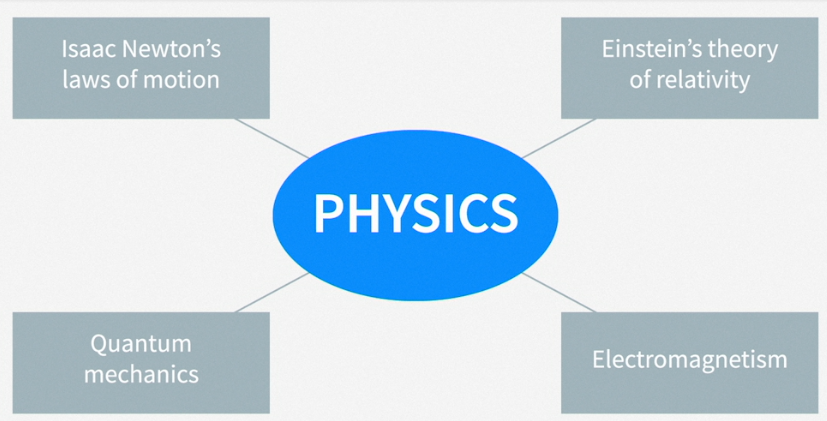
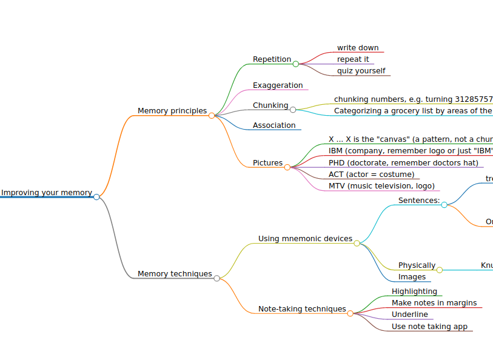

# Improving your memory

Notes on the linkedin learning course by Paul Nowak

<!-- START doctoc generated TOC please keep comment here to allow auto update -->
<!-- DON'T EDIT THIS SECTION, INSTEAD RE-RUN doctoc TO UPDATE -->
**Table of Contents**

- [Memory principles](#memory-principles)
  - [Repetition](#repetition)
  - [Exaggeration](#exaggeration)
  - [Chunking](#chunking)
  - [Association](#association)
  - [Pictures](#pictures)
- [Memory techniques](#memory-techniques)
  - [Using mnemonic devices](#using-mnemonic-devices)
  - [Note-taking techniques](#note-taking-techniques)
  - [Verbalization - using songs, rhymes, and alliteration](#verbalization---using-songs-rhymes-and-alliteration)
  - [The story method](#the-story-method)
  - [The link system](#the-link-system)
  - [Memory palaces and the method of loci ("low-cy")](#memory-palaces-and-the-method-of-loci-low-cy)
  - [Similar sound technique](#similar-sound-technique)
- [Using the Mnemonic Peg System](#using-the-mnemonic-peg-system)
  - [Linking numbers to pictures](#linking-numbers-to-pictures)
  - [Memorizing ten items](#memorizing-ten-items)
  - [Memorizing more than ten items](#memorizing-more-than-ten-items)
- [Situational methods](#situational-methods)
  - [How to remember names](#how-to-remember-names)
  - [How to remember presentations](#how-to-remember-presentations)
  - [How to remember what you read](#how-to-remember-what-you-read)
  - [Remembering passwords](#remembering-passwords)
  - [Remembering important dates](#remembering-important-dates)
  - [Remembering numbers](#remembering-numbers)
  - [Remembering formulas](#remembering-formulas)
  - [Remembering a to-do list](#remembering-a-to-do-list)
  - [Memorize words in foreign languages](#memorize-words-in-foreign-languages)
  - [Memorizing speeches or scripts word for word](#memorizing-speeches-or-scripts-word-for-word)
- [Own notes and links for spanish etc.](#own-notes-and-links-for-spanish-etc)

<!-- END doctoc generated TOC please keep comment here to allow auto update -->

## Memory principles

The short term memory can memorize about 7 (+/-2) items (Millers law).

### Repetition

Repetition: finding ways of repeating / rehearsing information. The foundation of improving memory.

- write down
- repeat it
- quiz yourself

### Exaggeration

If something is exaggerated / absurd / ridiculous it's easier to remember. Examples given: month of february has an "exaggerated" low number of days compared to the other months, which all have 30 or 31; celebrities in memorable outfits.

Can be used as a memorization technique.

### Chunking

Chunking a lot of singular items into easier to memorize groups.

Examples:

- chunking numbers, e.g. turning 3128575757 into 312-857-4747
- Categorizing a grocery list by areas of the store or type (dairy, meat, produce)

### Association

Making information meaningful.

Baker/baker paradox: Names are more easily forgotten than other associations (given a photo of a person with the information that his name is "Mr. Baker" is harder to remember than "this guy is a baker").

The information of the occupation "baker" has more associations (bakers hat, smells, food etc.) and is thus easier to remember.

### Pictures

Visual information (e.g. Face of a person) is much easier to remember than abstract information (e.g. name). 

Memoization example (the example is of course made to be easily chunkable):

Remember the letters

X I B M P H D A C T M T V X

*Chunk* it into meaningful chunks or patterns with *associations" and imagine a *picture* or scene with it. As the scene is usually strange, it also uses the *exaggeration* technique.

- X ... X is the "canvas" (a pattern, not a chunk) - bookends to the story
- IBM (company, remember logo or just "IBM")
- PHD (doctorate, remember doctors hat)
- ACT (actor = costume)
- MTV (music television, logo)

"X At IBM there works a doctor who is also an actor on MTV X" or
an Image of an IBM worker with a doctors hat studying at his desk for the ACT test while watching MTV. 

-> short term memory "doubled" (remembering 14 items)

## Memory techniques

### Using mnemonic devices

Examples:

- Sentences:
    - treble clef key note lines from bottom to top: "**E**very **G**ood **B**oy **D**oes **F**ine" (german (B is H): Ein Guter Hund Darf Fast Alles).
    - Order of mathematical operations:
        - **P**lease (parenthesis)
        - **E**xcuse (exponents)
        - **M**y (multiplication)
        - **D**ear (division)
        - **A**unt (addition)
        - **S**ally (subtraction)
- Physically
    - Knuckle mnemonic for days of month
- Images

To easily get mnemonics for common topics, search for *keyword* mnemonic or *stichwort* eselsbrücke.

### Note-taking techniques

Taking notes is a form of repetition (even without referring back to them later).

- Highlighting
- Make notes in margins
- Underline
- Use note taking app

Outlines are good for sequential information (historic dates etc.).

Another organized approach to note-taking for information that is not sequential that mimics more how the mind works: *mind mapping*, including colors and visuals. Good for topics that don't have a set order:

Example of this readme up to this point, generated using [markmap](https://markmap.js.org/repl) (though pen and paper might be more effective):

### Verbalization - using songs, rhymes, and alliteration

Songs:

- "ABC" alphabet mnemonic song
- Text is easier to remember as a song
- Learning languages is more effective when singing the words than speaking them

This works by

- various forms of repetition (the song itself and its individual parts such as chorus, beats etc.)
- linking the melody to easily remembered emotions, e.g. a favorite song or a melody tied to a specific event

Other techniques:

- Rhymes (utilizes auditory memory strength)
- Alliteration ("**S**uper **S**ummer **S**ale"); Can help remembering names: "Tall Tim" or "Talkative Tim" (association + alliteration)

### The story method

The human mind is wired to remember stories.

- Try to remember a specific set of details in the form of a story (and exaggerate!) like the PHD at IBM acting on MTV.

### The link system

Linking one item to another (memory chain). For remembering sequential things (a speech or a process).

Example (unrelated items, so not a real-world example):

1) pen
2) shoe
3) book
4) airplane
5) eyeglasses
6) fish
7) coffee
8) printer

Link **pen** and **shoes** and the other items using exageration - the images don't have to make sense, and it's even better if they don't:

1) Having **pens** as **shoes** (linking pens and shoes)
2) A **book** walking around in **giant shoes**
3) An airplane with an opened book as wings
4) An airplane wearing giant eyeglasses
5) A fish wearing eyeglasses 
6) A pond made of coffee with overactive fish jumping in and out
7) A printer using hot, steaming, smelling coffee as ink

Now we have just one less "item" to remember, but we can remember them as memorable images instead of words or mundane things. The order of the items in the individual pairs most often derive from the context in real world applications of the technique.

### Memory palaces and the [method of loci](https://en.wikipedia.org/wiki/Method_of_loci) ("low-cy")

Loci is the plural of locus (=place).

### Similar sound technique

## Using the Mnemonic Peg System

### Linking numbers to pictures

### Memorizing ten items

### Memorizing more than ten items

## Situational methods

### How to remember names

### How to remember presentations

### How to remember what you read

### Remembering passwords

### Remembering important dates

### Remembering numbers

### Remembering formulas

### Remembering a to-do list

### Memorize words in foreign languages

### Memorizing speeches or scripts word for word

## Own notes and links for spanish etc.

Spanish stuff (learn vocab with songs):

https://www.youtube.com/results?sp=mAEB&search_query=songs+for+learning+spanish+advanced

https://www.youtube.com/watch?v=4xgsJVsAFpk&list=PL2RLDc3Akk8snxqxgWYaQIRPNIJSf-Yvo
